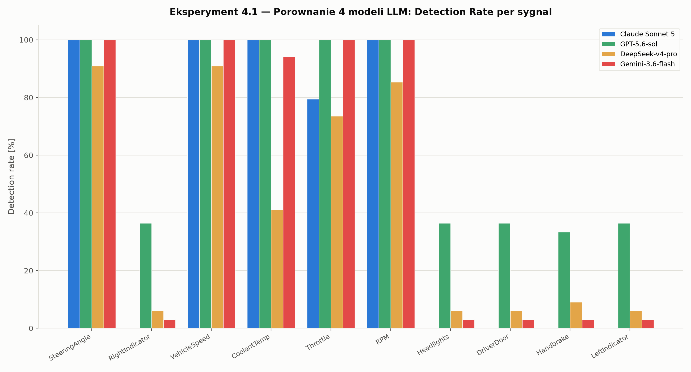
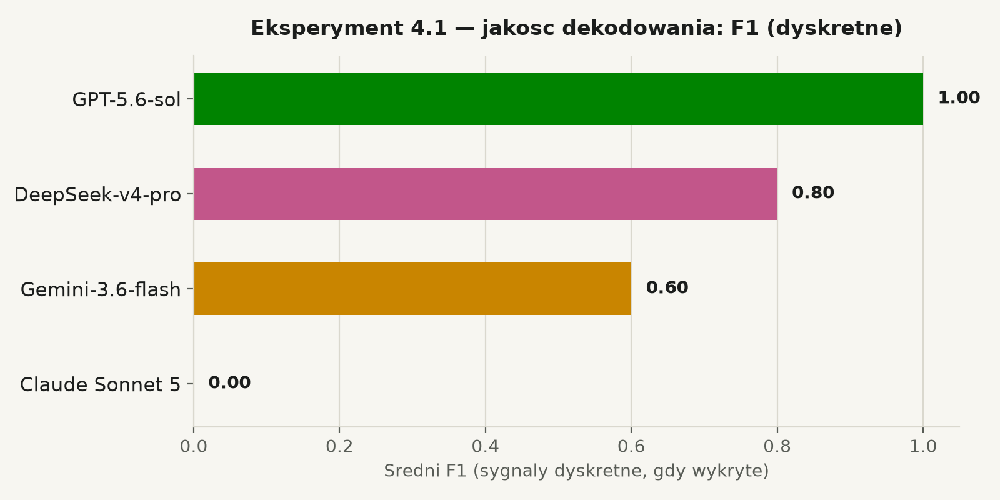
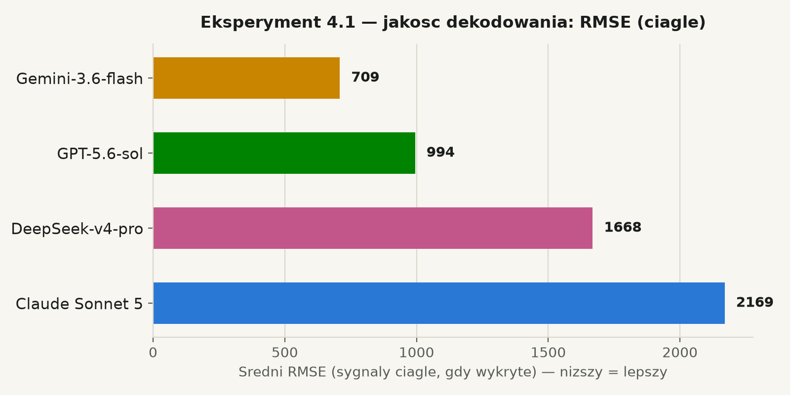

# Eksperyment 4.1 — Porównanie 4 modeli LLM w dekodowaniu sygnałów CAN

**Claude Sonnet 5 · GPT-5.6-sol · DeepSeek-v4-pro · Gemini-3.6-flash**

Data: 2026-07-27 · Projekt: MagistralaCAN4 (CAN-Edge-AI) · N=100 prób na model

---

## Metodyka

Identyczna dla wszystkich 4 modeli: syntetyczny mini-DBC (10 sygnałów na 3
identyfikatorach CAN — `0x100` EngineData, `0x150` SteeringData, `0x200`
BodyStatus), generowany w czasie rzeczywistym przez PEAK PCAN-USB z
realistyczną zmiennością wartości. Dla każdej z N=100 prób: świeży Cold
Start → zapytanie do LLM o reguły dekodujące → ocena 10 kolejnych ramek
tego identyfikatora względem znanego ground truth.

**Mierzone parametry:**
- *Detection rate* — odsetek prób, w których model zaproponował regułę
  na dokładnie właściwym bajcie/bicie.
- *F1* — dla sygnałów dyskretnych (5×, flagi bitowe), liczony tylko wśród
  prób, w których sygnał został wykryty.
- *RMSE* — dla sygnałów ciągłych (5×: RPM, temperatura, przepustnica, kąt
  kierownicy, prędkość), analogicznie tylko wśród wykrytych prób.

### Dwa błędy metodologiczne znalezione i naprawione w trakcie sesji

1. **Błąd dopasowania bajt/bit** — pierwsza wersja kodu porównującego
   dopasowywała ground truth do reguły LLM tylko po numerze bajtu, nie po
   konkretnym bicie — dawało to fikcyjne wyniki dla sygnałów dzielących
   jeden bajt (5 flag w `0x200`). Naprawione.
2. **Ucinanie odpowiedzi (`maxTokens`)** — domyślny limit 1024 tokenów
   (odziedziczony z wcześniejszego eksperymentu, gdzie treść odpowiedzi
   nie była parsowana) katastrofalnie ucinał odpowiedzi DeepSeek (model
   "rozumujący" — ucinane w połowie rozumowania, nigdy nie docierał do
   JSON-a) i Gemini (ucinane w połowie pierwszego pola JSON), dając
   fikcyjne 0% detection rate dla obu. Nawet Claude miał 13/54 odpowiedzi
   nieukończonych. Naprawione (`maxTokens=8192`), wszystkie 4 modele
   przetestowane od zera. **Wyniki poniżej pochodzą z poprawionego
   przebiegu.**

---

## Wynik główny — Detection Rate

| Ranking | Model | Średni detection rate (10 sygnałów) |
|---|---|---|
| 1 | **GPT-5.6-sol** | **67,9%** |
| 2 | Gemini-3.6-flash | 50,9% |
| 3 | Claude Sonnet 5 | 47,9% |
| 4 | DeepSeek-v4-pro | 41,5% |

## Jakość dekodowania gdy sygnał wykryty

| Model | Śr. F1 (dyskretne) | Śr. RMSE (ciągłe, niższy = lepszy) |
|---|---|---|
| GPT-5.6-sol | **1,000** (idealny) | 994,4 |
| Gemini-3.6-flash | 0,600 | **708,7** (najlepszy) |
| DeepSeek-v4-pro | 0,800 | 1668,3 |
| Claude Sonnet 5 | brak danych (0/5) | 2169,4 (najgorszy) |

## Pełna tabela — Detection Rate per sygnał [%]

| Sygnał | Claude | GPT-5.6-sol | DeepSeek | Gemini |
|---|---|---|---|---|
| SteeringAngle | 100,0 | 100,0 | 90,9 | 100,0 |
| VehicleSpeed | 100,0 | 100,0 | 90,9 | 100,0 |
| RPM | 100,0 | 100,0 | 85,3 | 100,0 |
| CoolantTemp | 100,0 | 100,0 | 41,2 | 94,1 |
| Throttle | 79,4 | 100,0 | 73,5 | 100,0 |
| RightIndicator | 0,0 | 36,4 | 6,1 | 3,0 |
| Headlights | 0,0 | 36,4 | 6,1 | 3,0 |
| DriverDoor | 0,0 | 36,4 | 6,1 | 3,0 |
| Handbrake | 0,0 | 33,3 | 9,1 | 3,0 |
| LeftIndicator | 0,0 | 36,4 | 6,1 | 3,0 |

---

## Kluczowe obserwacje

**GPT-5.6-sol wygrywa jednoznacznie** — najwyższy detection rate ORAZ
perfekcyjna jakość (F1=1,000) na wszystkich wykrytych sygnałach dyskretnych
ORAZ drugi najlepszy RMSE. Jedyny model konsekwentnie prawidłowo
dekomponujący bajt `0x200` na 5 osobnych flag bitowych.

**Claude Sonnet 5 ma systematyczny, powtarzalny styl — nie błąd.** We
wszystkich 100 próbach dla `0x200` Claude konsekwentnie proponował JEDNĄ
wartość skalarną ("status_value" — tryb/licznik) zamiast dekompozycji na
bity. To spójna strategia interpretacyjna, która pod naszym ścisłym
kryterium (dokładna pozycja bitu) daje 0%, ale niekoniecznie oznacza
gorszą jakość modelu w ogóle — tylko niedopasowanie do STRUKTURY akurat
tego testowego sygnału.

**DeepSeek-v4-pro najsłabszy** pod względem detection rate (41,5%) i RMSE
(1668,3) — model "rozumujący", dłuższy czas odpowiedzi (t_llm rzędu
15-60s), co przy tym samym budżecie tokenów zostawia mniej miejsca na
precyzyjną, ustrukturyzowaną odpowiedź końcową.

**Gemini-3.6-flash ma najlepszy RMSE (708,7)** ze wszystkich modeli, gdy
poprawnie zidentyfikuje sygnał — sugeruje najbardziej precyzyjne
oszacowanie skali/offsetu z całej czwórki, mimo środkowego miejsca w
detection rate.

## Wniosek końcowy

Nie ma jednego uniwersalnego "najlepszego modelu do wszystkiego":

- **GPT-5.6-sol** — najlepszy całościowo, dobry domyślny wybór.
- **Gemini-3.6-flash** — najlepsza precyzja liczbowa gdy trafi, rzadziej
  dekomponuje bity poprawnie.
- **Claude Sonnet 5** — solidny na sygnałach ciągłych, ale systematycznie
  inna (nie: gorsza) strategia dla upakowanych flag bitowych.
- **DeepSeek-v4-pro** — najsłabszy w tym teście, prawdopodobnie kosztem
  długiego "rozumowania" zjadającego budżet tokenów.

---

*Pełne dane: `Eksperyment_4.1_Model_Comparison_20260727.csv`. Surowe
raporty JSON: `Eksperyment_4.1_DecodingAccuracy_{Claude,GPT,DeepSeek,Gemini}_v2_*/`.*
