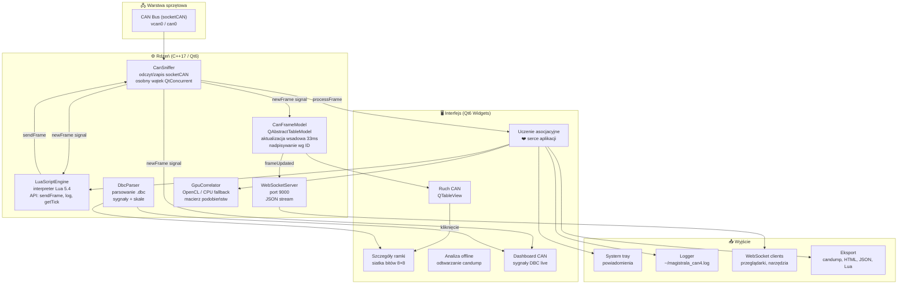

# MagistralaCAN4

**Wysokowydajny, wielowątkowy sniffer CAN / CAN FD** z zaawansowanym uczeniem asocjacyjnym, silnikiem skryptowym Lua, akceleracją GPU i serwerem WebSocket.


---

## Schemat blokowy



---

## Architektura

| Warstwa | Komponent | Odpowiedzialność |
|---------|-----------|-----------------|
| **Sprzętowa** | socketCAN (Linux) | Odczyt i zapis ramek CAN/CAN FD przez `PF_CAN` + `SOCK_RAW` |
| **Rdzeń** | `CanSniffer` | Wielowątkowy odczyt (`QtConcurrent::run`), emisja `newFrame` |
| **Rdzeń** | `CanFrameModel` | Model tabeli Qt (6 kolumn), nadpisywanie wg ID, batch co 33 ms |
| **Rdzeń** | `AssociativeLearner` | Warstwa UI uczenia asocjacyjnego (tabele, wykresy, widgety) |
| **Rdzeń** | `LearningEngine` | Czysty C++ silnik ML (37 algorytmów): korelacje, GBT, Granger, k-means, DBSCAN, PCA, FFT |
| **Rdzeń** | `LuaScriptEngine` | Wykonywanie skryptów `.lua` z API CAN |
| **Rdzeń** | `DbcParser` | Parsowanie plików `.dbc`, dekompozycja sygnałów |
| **Rdzeń** | `GpuCorrelator` | Obliczenia macierzy podobieństw (OpenCL z fallbackiem CPU) |
| **Rdzeń** | `WebSocketServer` | Stream JSON ramek CAN do klientów (port 9000) |
| **GUI** | `MainWindow` | QTabWidget z 5 zakładkami, toolbar, system tray |
| **GUI** | `FrameDetailWidget` | Siatka bitów 8×8, podświetlanie zmian, edycja ramek |
| **GUI** | `CanDashboard` | Live dashboard sygnałów DBC |
| **GUI** | `OfflineAnalyzer` | Odtwarzanie plików candump ze zmienną prędkością |

### Przepływ ramki CAN

```
socketCAN → read() → CanSniffer::doWork() → parseFrame()
                                              ↓
                                     emit newFrame(frame)
                                     ╱        │         ╲
                            MainWindow    Associative    LuaScript
                            (batch GUI)   Learner        Engine
                                 │         (processFrame)  (onNewFrame)
                          CanFrameModel       ↓              ↓
                          (33ms batch)    analityka     skrypt Lua
```

---

## Zakładki aplikacji

### 1. Ruch CAN

Główna tabela pokazująca ruch na magistrali w czasie rzeczywistym.

- **Kolumny**: ID, Extended, RTR, DLC, Data (hex), Timestamp
- **Nadpisywanie**: checkbox w toolbarze — nowsze ramki o tym samym ID zastępują starsze
- **Auto-scroll**: przewija się automatycznie, zatrzymuje przy ręcznym skrolowaniu
- **Eksport**: przycisk "📥 Eksportuj candump" zapisuje do pliku w formacie candump

### 2. Uczenie asocjacyjne (❤️ serce aplikacji)

Najbardziej rozbudowany moduł — patrz [szczegółowy opis poniżej](#uczenie-asocjacyjne--szczegółowy-opis).

### 3. Szczegóły ramki

Widok pojedynczej ramki CAN po kliknięciu w tabeli.

- **Siatka bitów 8×8**: wizualizacja bajtów i bitów
- **Podświetlanie zmian**: bity zmienione względem poprzedniej ramki tego samego ID są podświetlane
- **Sygnały DBC**: po wczytaniu pliku `.dbc` pokazuje nazwy i wartości sygnałów
- **Edycja**: kliknięcie bajtu pozwala zmienić wartość (hex/bin), przycisk "Wyślij zmodyfikowaną ramkę" wysyła na magistralę

### 4. Analiza offline

Odtwarzacz plików `candump`.

- **Wczytywanie**: plik candump (format standardowy)
- **Prędkość**: suwak od 0.1× do 10× prędkości oryginalnej
- **Oryginalne timestampy**: checkbox — odtwarzanie z rzeczywistymi odstępami czasu lub stałym interwałem
- **Tryb krokowy**: przycisk "Następna ramka" lub klawisz Enter
- **Integracja**: ramki są podawane do `AssociativeLearner` i `LuaScriptEngine`

### 5. Dashboard CAN

Live dashboard sygnałów DBC.

- Po wczytaniu pliku `.dbc` automatycznie tworzy panele dla wszystkich sygnałów
- Wyświetla nazwę sygnału, aktualną wartość i jednostkę
- Aktualizowany na żywo dla każdej ramki CAN

---

## Uczenie asocjacyjne — szczegółowy opis

Zakładka "Uczenie asocjacyjne" to zaawansowany moduł analityczny służący do odkrywania zależności między zmiennymi fizycznymi a ruchem na magistrali CAN. Umożliwia rejestrację zdarzeń, analizę statystyczną i predykcję.

### Filozofia działania

System uczy się powiązań między **zmiennymi użytkownika** (np. temperatura, prędkość) a **ramkami CAN**. Wszystkie dane są automatycznie zapisywane co 5 minut (auto-save do `autosave_learner.json`) oraz na żądanie przez przyciski eksportu/importu. Użytkownik rejestruje zdarzenia (wartość zmiennej + okno czasowe ramek CAN), a system znajduje identyfikatory CAN, których charakterystyka koreluje ze zmianami zmiennej. Dodatkowo użytkownik może rejestrować **braki zdarzeń** — okna bez istotnych zmian zmiennej — jako tło kontrastowe.

### Sekcje interfejsu

#### Zarządzanie zmiennymi

- **Dodawanie zmiennych**: pole tekstowe "Nazwa" + przycisk "Nowa"
- **Wybór zmiennej**: QComboBox z listą wszystkich zmiennych
- **Wprowadzanie wartości**: pole "Wartość" + przycisk "Dodaj obserwację" — rejestruje wartość liczbową zmiennej wraz z bieżącym oknem ramek CAN

#### Rejestracja zdarzeń

| Przycisk | Skrót | Działanie |
|----------|-------|-----------|
| 🔴 Zarejestruj zdarzenie | `Ctrl+Shift+E` | Zapisuje okno ramek jako zdarzenie pozytywne, inkrementuje licznik iteracji, odświeża tabele |
| ⛔ Brak zdarzenia | `Ctrl+Shift+D` | Zapisuje okno ramek jako non‑event (tło kontrastowe), obniża score kandydatów podobnych do tła |
| Resetuj uczenie | — | Czyści wszystkie dane, zmienne i modele |

#### Tabela kandydatów (CandidateModel)

Ranking identyfikatorów CAN wg podobieństwa cech między zdarzeniami, z kontrastem na tle non‑eventów.

- **Kolumny**: CAN ID, Opis, Pewność (0–1), Wystąpienia
- **Algorytm**: cosinusowa miara podobieństwa między wektorami cech (liczba ramek, średni odstęp, odchylenie standardowe, średnie bajtów)
- **Kontrast z tłem**: `score = score × (1 − similarity_to_background × 0.5)`

#### Tabele analityczne

| Tabela | Opis |
|--------|------|
| **Korelacja wartość–bajt** | Współczynnik korelacji Pearsona między wartością zmiennej a poszczególnymi bajtami ramek CAN |
| **Sekwencje bigramów/trigramów** | Najczęstsze sekwencje ID ramek w oknach zdarzeń |
| **Korelacja międzybajtowa** | Korelacje między parami bajtów z różnych ID |
| **Mutual Information (MI)** | Zależności nieliniowe — estymacja histogramowa (10×10 binów), równoległa |
| **Maximal Information Coefficient (MIC)** | Próbkowanie siatek 2×2 do 8×8, maksymalna MI znormalizowana |
| **Predykcja wartości** | Regresja liniowa `y = a·byte + b`, tylko dla `|r| > 0.8` |
| **Predykcja sekwencji (Markov)** | Łańcuch Markowa — najbardziej prawdopodobny następny ID |

#### Klastrowanie

- **k‑średnich**: grupuje okna czasowe w klastry na podstawie cech (liczba ramek, liczba unikalnych ID, entropia, czas trwania)
- **Auto K (łokieć)**: automatyczny dobór optymalnej liczby klastrów metodą łokcia (WCSS)
- **PCA + k‑średnich**: redukcja wymiarowości do 2D (metoda potęgowa), wizualizacja na wykresie scatter (3 klastry)

#### Detekcja anomalii

- Buduje model normalny (średnia i odchylenie standardowe cech okien)
- Monitoruje co 1 s — porównuje bieżące okno z modelem
- Alarm przy przekroczeniu progu (konfigurowalny, domyślnie 10.0)

#### Auto‑detekcja zdarzeń

- Monitoruje gradient zmiennej
- Przy przekroczeniu progu sprawdza, czy w ostatnich 500 ms pojawiły się ramki o ID wcześniej skorelowanym ze zmienną
- Automatycznie rejestruje zdarzenie

#### Macierz korelacji zmiennych

- Heatmapa korelacji Pearsona między wszystkimi zmiennymi (kolorowane komórki)

#### Zaawansowana analiza ML (NOWE v2.1)

| Funkcja | Opis |
|---------|------|
| **Przyczynowość Granger** | Test F (OLS, eliminacja Gaussa) — czy zmiany bajtu CAN przewidują zmiany zmiennej? |
| **Punkty zmiany** | Binary Segmentation — wykrywanie nagłych zmian w szeregach czasowych CAN |
| **Korelacja z przesunięciem** | Cross-correlation z lagiem [-10,+10] — które bajty wyprzedzają zmienną? |
| **Gradient Boosted Trees** | XGBoost-lite — nieliniowa predykcja wartości zmiennej z ramek CAN |
| **Online learning (Welford)** | Korelacje aktualizowane przyrostowo — O(1) na obserwację, bez przechowywania historii |
| **EWMA anomaly** | Adaptacyjne wykrywanie anomalii z wygładzaniem wykładniczym |

#### Eksport / Import

| Funkcja | Format |
|---------|--------|
| 💾 Zapisz sesję | JSON (wszystkie obserwacje, zdarzenia, parametry, modele) |
| 📂 Wczytaj sesję | JSON (pełne odtworzenie stanu — zmienne, tabele, wykresy) |
| 📤 Eksportuj modele | JSON (modele liniowe per ID/bajt/zmienna) |
| 📥 Importuj modele | JSON (podgląd zmiennych z modelami) |
| 📝 Generuj skrypt Lua | `.lua` (istotne ID p<0.05 + modele predykcyjne + funkcja `filter:match`) |
| 📄 Eksportuj raport HTML | HTML (ciemny motyw, tabela korelacji, modele, statystyki) |

#### Wykres scatter

Wykres zależności wartości zmiennej od wybranego bajtu (QChart, QScatterSeries).

---

## Skrypty Lua — dokumentacja API

Silnik Lua umożliwia wykonywanie skryptów reagujących na każdą ramkę CAN. Skrypty są ładowane przez `📜 Wczytaj skrypt Lua` w toolbarze.

### Wymagana struktura skryptu

```lua
function onFrame(id, data, timestamp)
    -- kod wykonywany dla każdej ramki
end
```

### API

#### `sendFrame(id, data_table)`

Wysyła ramkę CAN na magistralę.

- **Parametry**:
  - `id` (integer) — identyfikator CAN (11-bit lub 29-bit)
  - `data_table` (table) — tablica bajtów, indeksowana od 1, maks. 64 elementy
- **Zwraca**: `true` przy sukcesie, `false, error_msg` przy błędzie
- **Przykład**:
  ```lua
  local ok, err = sendFrame(0x123, {0xAA, 0xBB, 0xCC})
  if not ok then log("Błąd: " .. err) end
  ```

#### `log(message)`

Zapisuje wiadomość do logu aplikacji.

- **Parametry**: `message` (string)
- **Przykład**:
  ```lua
  log("Odebrano ramkę ID: " .. string.format("0x%X", id))
  ```

#### `getTick()`

Zwraca liczbę milisekund od uruchomienia silnika Lua.

- **Zwraca**: `integer` — timestamp w ms
- **Przykład**:
  ```lua
  local elapsed = getTick()
  ```

### Pełny przykład — monitorowanie ID

```lua
-- monitorowanie ramek z ID 0x123
-- jeśli bajt 0 przekracza 0x80, wyślij odpowiedź
function onFrame(id, data, timestamp)
    if id == 0x123 then
        if data[1] > 0x80 then
            log("Wysoka wartość: " .. data[1])
            sendFrame(0x456, {0x01, 0x02})
        end
    end
end
```

### Przykład — filtrowanie z logowaniem

```lua
local counter = 0

function onFrame(id, data, timestamp)
    counter = counter + 1
    if counter % 100 == 0 then
        log(string.format("Odebrano %d ramek (ostatni ID: 0x%X)", counter, id))
    end
end
```

### Generowanie skryptów z uczenia asocjacyjnego

Przycisk "📝 Generuj skrypt Lua" tworzy skrypt z istotnymi statystycznie ID (p<0.05), modelami predykcyjnymi i funkcją `filter:match(frame)`:

```lua
-- MagistralaCAN4 auto-generated filter script
-- Variable: temperatura

local filter = {}

filter.significantIds = {
    [0x18F] = { byte = 3, corr = 0.942 },
    [0x200] = { byte = 0, corr = 0.871 },
}

filter.models = {
    { id = 0x18F, byte = 3, a = 2.3500, b = 15.2000 },
}

function filter:match(frame)
    for id, cfg in pairs(self.significantIds) do
        if frame.id == id and frame.dlc > cfg.byte then
            return true
        end
    end
    return false
end

return filter
```

---

## WebSocket Server

Serwer WebSocket streamujący ramki CAN jako JSON. Domyślnie nasłuchuje na porcie **9000**.

### Format JSON

```json
{
  "type": "frame",
  "id": 4660,
  "extended": false,
  "rtr": false,
  "error": false,
  "fd": false,
  "dlc": 8,
  "data": "a1b2c3d4e5f60708",
  "dataBytes": [161, 178, 195, 212, 229, 246, 7, 8],
  "timestamp": 1715123456789
}
```

### Klient testowy (JavaScript)

```javascript
const ws = new WebSocket('ws://localhost:9000');
ws.onmessage = (e) => {
    const frame = JSON.parse(e.data);
    console.log(`CAN ID: 0x${frame.id.toString(16)}, DLC: ${frame.dlc}, Data: ${frame.data}`);
};
```

---

## Pliki DBC

Parser DBC wspiera standardowe pliki `.dbc` (Vector CANdb++).

### Struktury

- **DbcMessage**: ID, nazwa, DLC, lista sygnałów
- **DbcSignal**: nazwa, startBit, długość, little/big endian, signed/unsigned, scale, offset, min, max, jednostka

### Użycie w aplikacji

1. Wczytaj plik DBC przez `🗄️ Wczytaj DBC` w toolbarze
2. Sygnały są automatycznie wyświetlane w:
   - **Szczegóły ramki** — nazwy sygnałów i wartości
   - **Dashboard CAN** — live wartości sygnałów w panelach

---

## Kompilacja

### Wymagania

| Zależność | Wersja | Instalacja (Debian/Kali) |
|-----------|--------|--------------------------|
| C++17 compiler | GCC 9+ / Clang 10+ | `build-essential` |
| CMake | ≥ 3.16 | `cmake` |
| Qt6 | ≥ 6.2 | `qt6-base-dev qt6-charts-dev qt6-websockets-dev` |
| Lua | 5.3 / 5.4 | `liblua5.4-dev` |
| OpenCL | 1.2+ | `opencl-headers ocl-icd-opencl-dev` |
| XCB | — | `libxcb1-dev` |
| Linux + socketCAN | — | moduły `can`, `vcan` |

### Budowanie

```bash
git clone <repo-url>
cd MagistralaCAN4
mkdir build && cd build
cmake .. -DCMAKE_BUILD_TYPE=Release
make -j$(nproc)
./MagistralaCAN4
```

### Konfiguracja wirtualnego interfejsu CAN (do testów)

```bash
sudo modprobe vcan
sudo ip link add dev vcan0 type vcan
sudo ip link set up vcan0
```

### Generowanie ramek testowych

```bash
# Instalacja can-utils
sudo apt install can-utils

# Generowanie losowych ramek
cangen vcan0 -v -I 123 -L 8 -g 10
```

---

## Struktura katalogów

```
MagistralaCAN4/
├── CMakeLists.txt              # Konfiguracja CMake
├── main.cpp                    # Punkt wejścia
├── README.md                   # Ten plik
├── deploy_websocket.sh         # Skrypt wdrożeniowy WebSocket
├── send_frame.lua              # Przykładowy skrypt Lua
├── src/
│   ├── core/                   # Rdzeń aplikacji
│   │   ├── CanFrame.h          # Struktura CanFrame (max 64 B)
│   │   ├── CanSniffer.h/.cpp   # Odczyt/zapis socketCAN
│   │   ├── CanFrameModel.h/.cpp # Model tabeli Qt
│   │   ├── AssociativeLearner.h/.cpp # UI uczenia asocjacyjnego
│   │   ├── LearningEngine.h/.cpp  # Czysty C++ silnik ML (37 algorytmów)
│   │   ├── GpuCompute.h/.cpp      # Akceleracja GPU (OpenCL)
│   │   ├── CandidateModel.h/.cpp # Model tabeli kandydatów
│   │   ├── GpuCorrelator.h/.cpp # Korelacje GPU (OpenCL)
│   │   ├── LuaScriptEngine.h/.cpp # Silnik Lua
│   │   ├── DbcParser.h/.cpp    # Parser plików DBC
│   │   ├── OfflineAnalyzer.h/.cpp # Analiza offline
│   │   ├── FrameDetailWidget.h/.cpp # Szczegóły ramki
│   │   ├── CanDashboard.h/.cpp # Dashboard CAN
│   │   ├── CanExporter.h/.cpp  # Eksport danych
│   │   ├── CanInterfaceEnumerator.h/.cpp # Lista interfejsów
│   │   ├── WebSocketServer.h/.cpp # Serwer WebSocket
│   │   └── Logger.h/.cpp       # Logger zdarzeń
│   └── gui/                    # Interfejs użytkownika
│       └── MainWindow.h/.cpp   # Główne okno (toolbar, zakładki)
├── tests/                      # Testy jednostkowe (Google Test + QTest)
│   ├── test_canframe.cpp
│   ├── test_canframemodel.cpp
│   ├── test_dbcparser.cpp
│   ├── test_learningengine.cpp
│   └── test_ringbuffer.cpp
└── .ws_backup_*/               # Backupy skryptów wdrożeniowych
```

---

## Skróty klawiszowe

| Skrót | Działanie | Kontekst |
|-------|-----------|----------|
| `Ctrl+Shift+E` | Zarejestruj zdarzenie (AssociativeLearner) | Globalny (okno aplikacji) |
| `Ctrl+Shift+D` | Zarejestruj brak zdarzenia | Globalny (okno aplikacji) |
| `Enter` | Następna ramka (OfflineAnalyzer) | Zakładka Analiza offline |

---

## Technologie

- **C++17** — standard języka
- **Qt 6.10** — Widgets, Charts, Concurrent, WebSockets
- **CMake 3.16+** — system budowania
- **Linux socketCAN** — `PF_CAN` / `SOCK_RAW`
- **OpenCL 3.0** — akceleracja GPU (fallback CPU)
- **Lua 5.4** — interpreter skryptowy
- **XCB** — protokół X Window (skróty klawiszowe)

---

## Licencja

MIT License — zobacz plik LICENSE.
